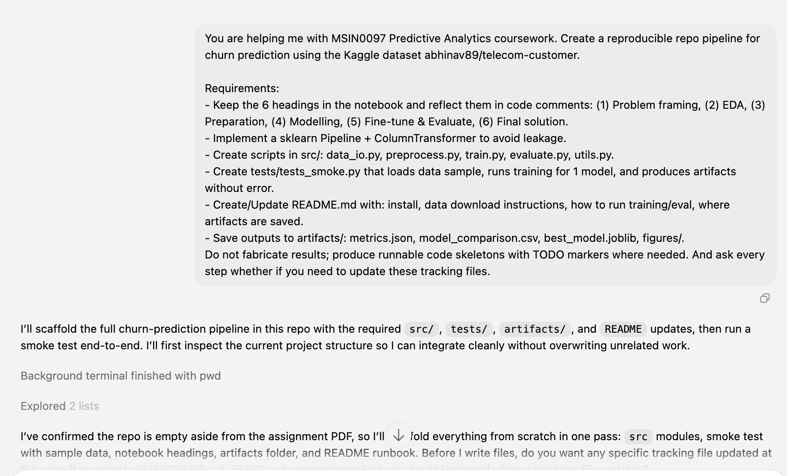
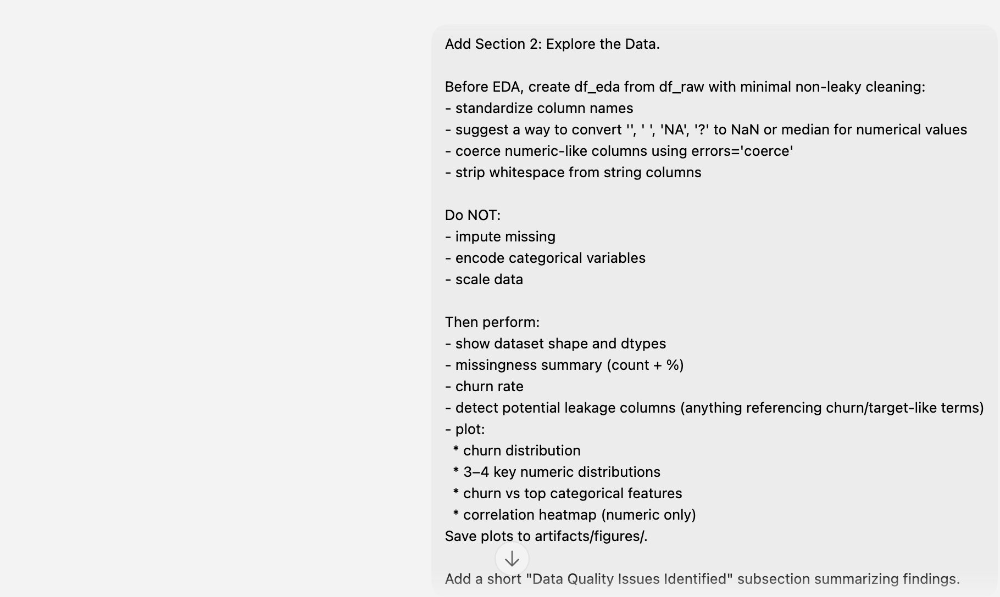
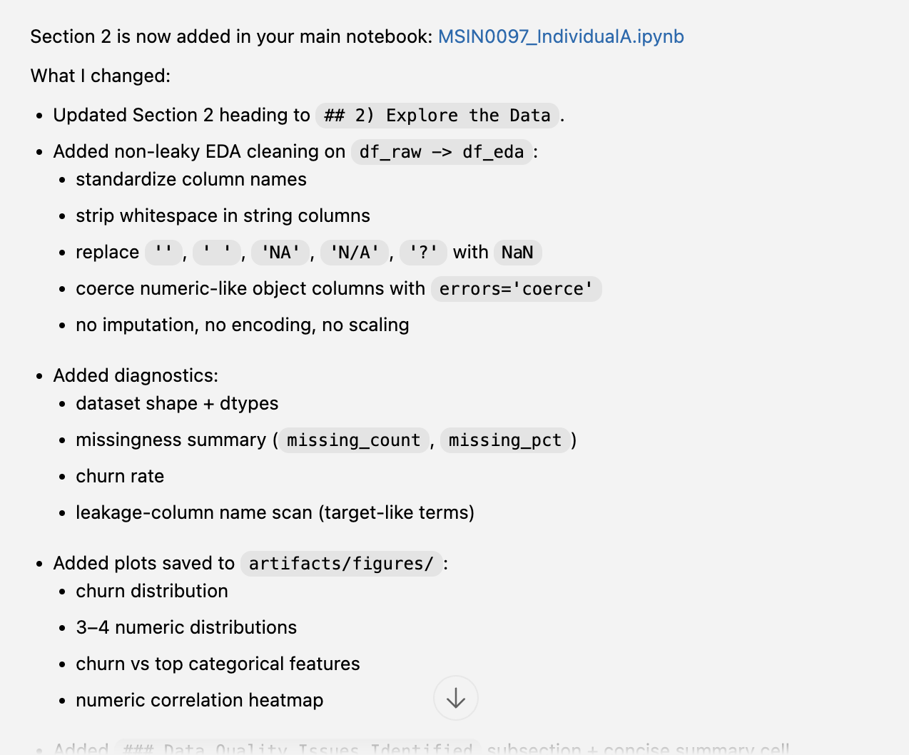
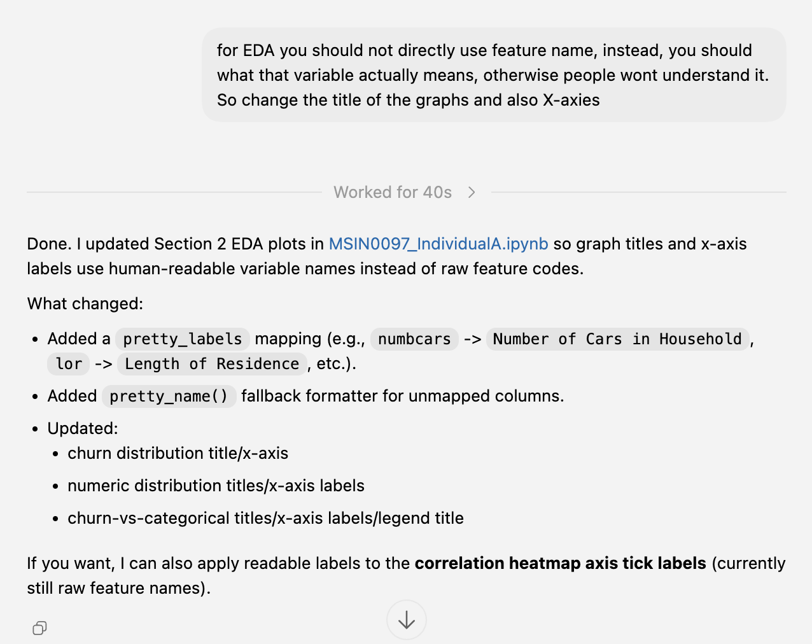
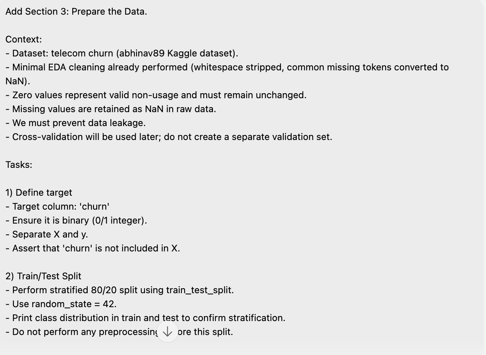
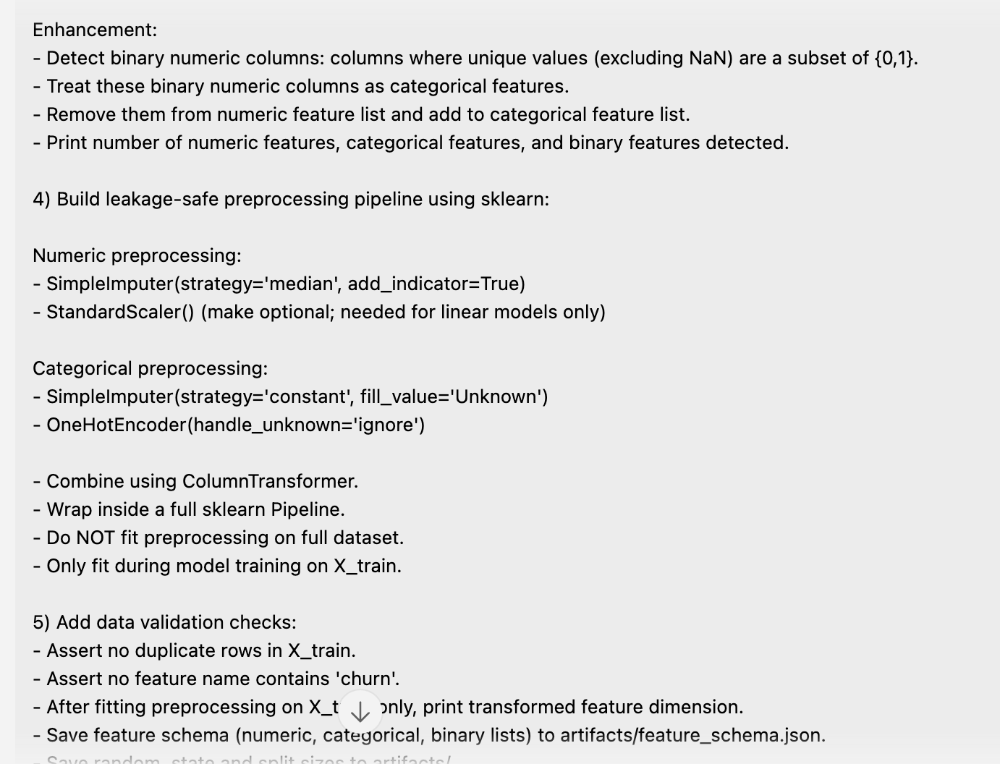
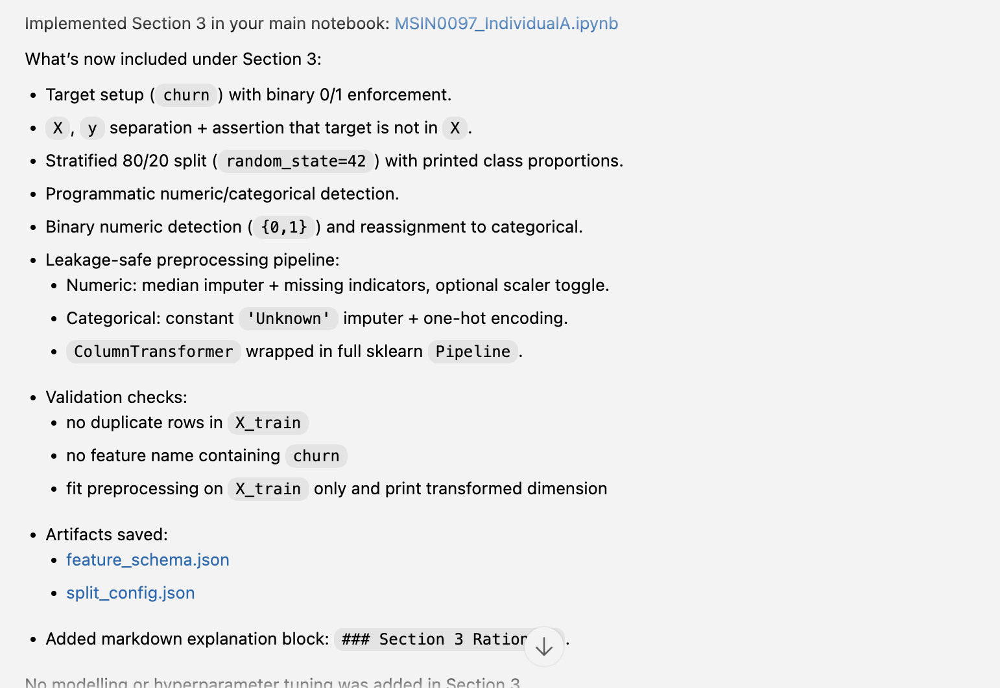

# AI USAGE LOG

Track meaningful AI-assisted work for appendix evidence.

## Logging Rules

- Log only substantive interactions that affect code, analysis, or decisions.
- Record what was delegated, what was verified manually, and the final outcome.
- Mark each item as `Accepted`, `Modified`, or `Rejected`.

## Entry 1 - Repository Pipeline Scaffold

- Date: 2026-02-26
- Stage: Setup
- Prompt/Task: Scaffold reproducible churn repo pipeline
- AI Output Summary: Created `src/` modules, smoke test, README, requirements, and artifacts layout.
- Manual Verification: Reviewed file structure and imports; checked notebook alignment.
- Decision: Modified
- Notes: Kept single main notebook and removed duplicate scaffold notebook.

## Entry 2 - Section 1 Problem Framing

- Date: 2026-02-26
- Stage: Section 1
- Prompt/Task: Add problem framing content in main notebook
- AI Output Summary: Added target/metrics/constraints/assumptions/agent-plan markdown and local loader cell.
- Manual Verification: Confirmed content and no Kaggle API call in notebook.
- Decision: Accepted
- Notes: Main notebook remains `MSIN0097_IndividualA.ipynb`.

## Entry 3 - Tracking Files and Audit Trail

- Date: 2026-02-26
- Stage: Tracking
- Prompt/Task: Add coursework tracking files and link them
- AI Output Summary: Added `TASKS.md`, `WORKFLOW_EVIDENCE.md`, `DECISION_REGISTER.md`, and linked tracking files in README.
- Manual Verification: Checked files exist and reflect current repo state.
- Decision: Accepted
- Notes: Supports appendix and reproducibility evidence.

## Entry 4 - Data Loading Path Fix

- Date: 2026-02-26
- Stage: Section 1 / Data IO
- Prompt/Task: Fix notebook data loading from local `data/` directory after manual download
- AI Output Summary: Updated Section 1 loader cell to search configurable `data/` and `data/raw/` CSV paths, including `data/raw/Telecom_customer churn.csv`.
- Manual Verification: Confirmed loader selects `data/raw/Telecom_customer churn.csv` and reads dataset shape `(100000, 100)`.
- Decision: Accepted
- Notes: Dataset schema differs from earlier assumed Telco file naming; target column must be confirmed before training.

## Entry 5 - Section 2 EDA Implementation

- Date: 2026-02-27
- Stage: Section 2
- Prompt/Task: Add full EDA workflow with minimal non-leaky cleaning and saved figures
- AI Output Summary: Implemented `df_eda` cleaning (column standardization, whitespace stripping, placeholder-to-NaN replacement, numeric-like coercion), missingness summary, churn rate, leakage-term scan, and plot exports to `artifacts/figures/`.
- Manual Verification: Confirmed dataset loads from `data/raw/Telecom_customer churn.csv` and Section 2 cells run with fallback loader for `df_raw`.
- Decision: Accepted
- Notes: EDA intentionally avoids imputation/encoding/scaling; these are deferred to Section 3 pipeline stage.

## Entry 6 - Agent Mistake in EDA Labels (Corrected by User Request)

- Date: 2026-02-27
- Stage: Section 2
- Prompt/Task: Improve EDA communication quality
- AI Output Summary: Initial EDA plots used raw feature codes as chart titles/axis labels.
- Manual Verification: User flagged that variable meanings were unclear to readers.
- Decision: Modified
- Notes: User correction required; notebook was updated to use human-readable labels for chart titles, x-axis labels, and legend text.

## Entry 7 - Section 3 Data Preparation Implementation

- Date: 2026-02-27
- Stage: Section 3
- Prompt/Task: Implement leakage-safe preparation workflow (no modelling)
- AI Output Summary: Added target handling, stratified split, feature typing, binary-flag detection, ID (`customer_id`) drop, dropped selected high-missing lower-priority fields (`numbcars`, `dwllsize`, `hhstatin`, `ownrent`, `dwlltype`, `infobase`) during preparation, preprocessing pipeline (numeric median+indicator; categorical Unknown+OHE with dtype-cast fix), validation checks, and artifact saves (`feature_schema.json`, `split_config.json`).
- Manual Verification: Confirmed preprocessing fit runs and outputs transformed dimension; reviewed anti-leakage rule (fit only on training split).
- Decision: Accepted
- Notes: Added explicit explanation in Section 3 for why transformed feature count exceeds raw feature count.

## Entry 8 - Section 4 Model Comparison Setup

- Date: 2026-02-28
- Stage: Section 4
- Prompt/Task: Implement model exploration and shortlist workflow using cross-validation only
- AI Output Summary: Added model zoo (Dummy, Logistic Regression, Random Forest, HistGradientBoosting, XGBoost), 5-fold `StratifiedKFold`, `cross_validate` scoring (`average_precision`, `roc_auc`, `f1`), runtime logging (`fit_time_mean`, `score_time_mean`), sorted comparison table save to `artifacts/model_comparison.csv`, and top-2 shortlist output.
- Manual Verification: Confirmed Section 4 code explicitly avoids test-set usage and saves comparison artifacts.
- Decision: Accepted
- Notes: PR-AUC remains the primary ranking metric for shortlisting.

## Entry 9 - Section 4 Ablation Test for High-Missing Feature Drop

- Date: 2026-02-28
- Stage: Section 4
- Prompt/Task: Test whether dropping selected high-missing household/profile features is justified by cross-validated performance
- AI Output Summary: Added a dedicated Section 4 ablation cell comparing the retained baseline feature set against a variant that drops the selected high-missing lower-priority fields, using the same 5-fold CV discipline and a fixed tree-based model.
- Manual Verification: User reviewed the ablation summary and confirmed that the dropped-feature variant performed better in the high-missing feature drop test.
- Decision: Accepted
- Notes: This was positioned as evidence for the Section 3 simplification rather than a new preparation rule.

## Entry 10 - Section 4 Ablation Test for Engineered Feature Value-Add

- Date: 2026-02-28
- Stage: Section 4
- Prompt/Task: Test whether the engineered features improve performance beyond the simplified retained baseline
- AI Output Summary: Added a second dedicated Section 4 ablation cell comparing the dropped-feature baseline against the same feature set plus engineered variables, then added a summary cell identifying the strongest-performing variant across the two tests.
- Manual Verification: User reviewed the ablation summary and confirmed that the engineered-feature variant did not improve PR-AUC relative to the dropped-feature baseline.
- Decision: Modified
- Notes: This changed the feature-set conclusion: engineered features remain documented as a tested candidate, but they are not retained in the default final pipeline unless later reruns show a different result.

## Entry 11 - Section 4 Feature-Set Refinement Before Section 5

- Date: 2026-02-28
- Stage: Section 4
- Prompt/Task: Resolve the inconsistency between the default Section 3 pipeline and the ablation result before moving into final benchmarking/tuning
- AI Output Summary: Updated the notebook so Section 3 now keeps the dropped-feature, no-engineering baseline as the default final preparation path; retained engineered features only as a separate candidate branch for Section 4 ablation; reordered Section 4 so feature-set ablation occurs before the final model-family comparison step.
- Manual Verification: User identified that the previous setup would have mixed a feature set not supported by the ablation into later benchmarking.
- Decision: Accepted
- Notes: This issue was caught during Section 4, before the final Section 5 workflow should be rerun on the finalized feature set.

## Entry 12 - Agent Metric Framing Mistake After Section 4 (Corrected)

- Date: 2026-02-28
- Stage: Section 4
- Prompt/Task: Clarify primary metric choice for a relatively balanced churn dataset
- AI Output Summary: The agent initially leaned toward ROC-AUC framing, but the final metric strategy was corrected.
- Manual Verification: User challenged the metric rationale and required a business-aligned explanation.
- Decision: Modified
- Notes: Final position: **Primary metric is PR-AUC (Average Precision)** because it aligns with the business goal of identifying churners. Because the dataset is relatively balanced, absolute PR-AUC / precision values may be optimistic versus a lower-prevalence real-world population, so **ROC-AUC is also reported** as a less class-balance-sensitive complement, and the write-up should discuss how performance would change under lower churn prevalence.

## Entry 13 - Section 4 Final Benchmark Rerun After Feature-Set Selection

- Date: 2026-02-28
- Stage: Section 4
- Prompt/Task: Finalize the feature set immediately after the Section 4 ablation tests, then rerun the Section 4 benchmark before carrying the workflow into Section 5
- AI Output Summary: After the ablation showed that engineered features should remain a tested candidate rather than a default retained step, the notebook was updated so the dropped-feature, no-engineering baseline became the default final preparation path, and the Section 4 model comparison was rerun on that finalized feature set before Section 5 tuning continued.
- Manual Verification: Current artifacts confirm the finalized Section 4 state: `feature_schema.json` marks `engineered_features_used_in_final_pipeline` as `false`, and `model_comparison.csv` reflects the refreshed benchmark on that feature set.
- Decision: Accepted
- Notes: This keeps the chronology correct: the feature-set correction and final benchmark rerun happen in Section 4, before the later tuning and held-out test evaluation stages.

## Entry 14 - Dependency and Environment Update (XGBoost)

- Date: 2026-02-28
- Stage: Environment / Section 4
- Prompt/Task: Make dependency setup complete for XGBoost evaluation
- AI Output Summary: Updated `requirements.txt` to include `seaborn` and `xgboost`; updated README with macOS OpenMP (`libomp`) note and fallback behavior.
- Manual Verification: User confirmed local `brew` + `libomp` install and XGBoost availability.
- Decision: Accepted
- Notes: This change improves reproducibility for markers running Section 4.

## Entry 15 - Section 5 Initial Tuning and Evaluation Workflow

- Date: 2026-03-01
- Stage: Section 5
- Prompt/Task: Implement full tuning/evaluation workflow for shortlisted models
- AI Output Summary: Added Section 5 code for train-only hyperparameter tuning of the top 2 shortlisted models (XGBoost and HistGradientBoosting), threshold tuning using out-of-fold training predictions, one-time held-out test evaluation, metrics/plots saving, and error analysis outputs.
- Manual Verification: Confirmed notebook structure includes Section 5 code plus narrative block, with explicit delayed test-set usage.
- Decision: Accepted
- Notes: The initial design tuned two shortlisted models before runtime constraints were reconsidered.

## Entry 16 - Section 5 Runtime-Constrained Simplification

- Date: 2026-03-01
- Stage: Section 5
- Prompt/Task: Reduce computational cost of tuning while preserving methodological validity
- AI Output Summary: Simplified Section 5 to tune XGBoost only, reduced `RandomizedSearchCV` to 12 iterations, switched tuning/OOF threshold CV to 3 folds, and narrowed the search space.
- Manual Verification: User identified runtime concerns; notebook was updated to use a lighter tuning strategy and explain the tradeoff in markdown.
- Decision: Modified
- Notes: This is a deliberate computational compromise rather than a methodological correction.

## Entry 17 - Agent-Made Serialization Bug in Preprocessing (Corrected)

- Date: 2026-03-01
- Stage: Section 3 / Section 5
- Prompt/Task: Fix model save failure during tuned pipeline persistence
- AI Output Summary: An agent-generated preprocessing design initially used lambda-based transformers inside the preprocessing pipeline.
- Manual Verification: The user encountered a `PicklingError` when `joblib.dump` attempted to save the tuned pipeline in Section 5.
- Decision: Modified
- Notes: I identified this bug and replaced the lambda-based design with separate sklearn-native preprocessing branches for numeric, object-categorical, and binary-flag features, making the final pipeline serializable and reproducible.

## Entry 18 - Section 5 Moderate Tuning Increase

- Date: 2026-03-01
- Stage: Section 5
- Prompt/Task: Increase tuning breadth slightly without returning to the full expensive search
- AI Output Summary: Increased XGBoost `RandomizedSearchCV` from 12 to 18 iterations and moderately widened the search space (`n_estimators`, `learning_rate`, `max_depth`, `min_child_weight`, `gamma`, `reg_alpha`) while keeping 3-fold CV.
- Manual Verification: User requested a moderate increase rather than a full revert to the original heavy search.
- Decision: Modified
- Notes: This keeps the tuning practical while exploring more of the parameter space than the lightweight version.

## Entry 19 - Section 6 Final Solution and Deployment Narrative

- Date: 2026-03-02
- Stage: Section 6
- Prompt/Task: Build the final solution section from saved artifacts only (no rerunning of modelling)
- AI Output Summary: Replaced the Section 6 placeholder with an artifact-driven reporting cell that reads saved metrics/tuning/split artifacts, summarizes the final model and hyperparameters, translates performance into business terms, outlines deployment and monitoring, documents risks/fairness considerations, and presents a concrete improvement roadmap and conclusion.
- Manual Verification: User reviewed the generated Section 6 tables and requested display refinements (hide index, show full text) rather than any metric changes.
- Decision: Accepted
- Notes: Section 6 remains non-modelling: it does not rerun training and does not touch the test set again.

## Entry 20 - Dedicated Mistake Log for Appendix Evidence

- Date: 2026-03-02
- Stage: Tracking / Appendix
- Prompt/Task: Create a dedicated record of AI-generated mistakes that were caught and corrected
- AI Output Summary: Added `MISTAKE_LOG.md` summarizing the major AI mistakes, how they were detected, what was changed, and why each correction mattered.
- Manual Verification: Cross-checked the mistake list against `AI_USAGE_LOG.md`, `WORKFLOW_EVIDENCE.md`, and the notebook workflow before adding it.
- Decision: Accepted
- Notes: This makes the “agent-made mistake” evidence explicit and easier for a marker to review in one place.
